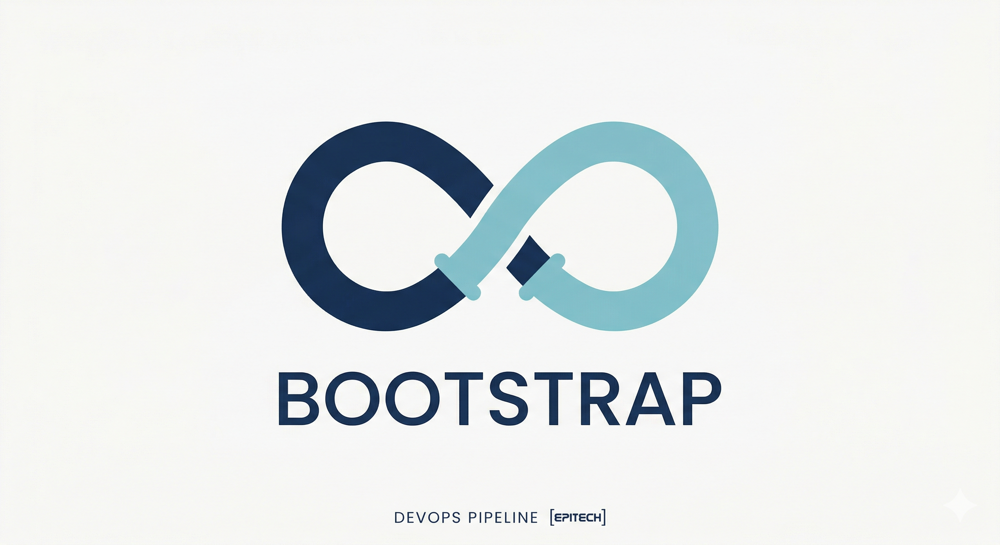

<div align="center">
  

  <h1>DevOps Bootstrap — Jeux VideOps</h1>

  <p>
    <strong>Premier projet DevOps réalisé dans le cadre du cursus <b>Web@cadémie Epitech Paris</b> (Promo W1).</strong><br>
    <em>Une application calculatrice Node.js / Express pour apprendre le CI/CD de bout en bout.</em>
  </p>

  

  <p>
    Stack & Outils • Présentation • Pipeline CI/CD • Fonctionnalités • Installation
  </p>
</div>

> [!IMPORTANT]
> **Objectif du projet :** mettre en place un pipeline CI/CD complet et fiable autour d’une application Node.js /
> Express.
> L’application calculatrice sert de support pédagogique pour valider les bonnes pratiques : lint, tests unitaires,
> couverture, E2E et documentation.

## 🛠️ Stack & Outils

<div align="center">
  
  
  
  
  
  
  
  
</div>

## ✨ Présentation du projet

Ce projet est une **application calculatrice** développée en **Node.js / Express**.
Elle expose plusieurs routes HTTP permettant d’effectuer des opérations arithmétiques simples :

- addition
- soustraction
- multiplication
- division
- puissance

L’application a été conçue comme un **support DevOps** pour mettre en pratique :

- l’automatisation des tests
- le contrôle de qualité du code
- la génération de couverture
- la documentation technique
- l’exécution de tests fonctionnels E2E

## 🚀 Pipeline CI/CD

Le workflow GitHub Actions est défini dans `.github/workflows/test.yml` et fonctionne en **deux jobs parallèles**.

### `my_first_job` — Prise en main

| Step        | Description                                  |
|-------------|----------------------------------------------|
| Checkout    | Clone du dépôt sur le runner                 |
| Setup Node  | Installation de Node.js `16.13.x`            |
| Install     | `npm ci` pour installer les dépendances      |
| Hello World | Vérification du bon fonctionnement du runner |
| List files  | Affichage de l’arborescence du projet        |

### `my_second_job` — Qualité & Automatisation

| Step                       | Outil    | Description                                         |
|----------------------------|----------|-----------------------------------------------------|
| Checkout + Setup + Install | —        | Préparation d’un environnement propre               |
| Lint                       | ESLint   | Vérification du style et des conventions JavaScript |
| Unit Tests                 | Mocha    | Validation des méthodes de `Calculator`             |
| Coverage Report            | nyc      | Vérification de la couverture à 100%                |
| Export Coverage            | nyc lcov | Génération du rapport HTML                          |
| Functional Tests           | Cypress  | Validation des routes HTTP réelles                  |
| Documentation              | JSDoc    | Génération automatique de la documentation          |

## 🧮 Fonctionnalités de l’application

### Routes principales

| Route            | Opération      | Exemple                          |
|------------------|----------------|----------------------------------|
| `GET /`          | Page d’accueil | `Welcome to the calculator app!` |
| `GET /add?a=&b=` | Addition       | `/add?a=2&b=3` → `2 + 3 = 5`     |
| `GET /sub?a=&b=` | Soustraction   | `/sub?a=5&b=2` → `5 - 2 = 3`     |
| `GET /mul?a=&b=` | Multiplication | `/mul?a=3&b=4` → `3 * 4 = 12`    |
| `GET /div?a=&b=` | Division       | `/div?a=10&b=2` → `10 / 2 = 5`   |
| `GET /pow?a=&b=` | Puissance      | `/pow?a=2&b=3` → `2 ^ 3 = 8`     |

### Comportement particulier

- La route `/div` gère le cas de la division par zéro.
- La route `/pow` permet de calculer une puissance positive, nulle ou négative.


## 📦 Lancer le projet en local

### Prérequis

- **Node.js**
- **npm**

### Installation

```bash
git clone https://github.com/sofian-bll/bootstrap-jeuvideops.git
cd bootstrap-jeuvideops
npm ci
```

### Lancer l’application

```bash
npm run app:serve
```

L’application sera disponible sur :

```text
http://localhost:3000
```

---

## 🧪 Scripts utiles

| Commande               | Description                                        |
|------------------------|----------------------------------------------------|
| `npm run app:serve`    | Lance l’application en local avec `nodemon`        |
| `npm run mocha:test`   | Exécute les tests unitaires                        |
| `npm run nyc:run`      | Lance les tests avec contrôle de couverture à 100% |
| `npm run nyc:coverage` | Génère le rapport de couverture HTML               |
| `npm run eslint:check` | Vérifie le style du code                           |
| `npm run cypress:test` | Lance les tests E2E Cypress                        |
| `npm run jsdoc`        | Génère la documentation dans `docs/`               |

---

## ✅ Tests

### Tests unitaires

Les tests unitaires sont situés dans `tests/test.js` et couvrent la classe `Calculator` :

- addition
- soustraction
- multiplication
- division
- puissance

### Tests fonctionnels

Les tests Cypress sont situés dans `cypress/e2e/test.cy.js` et valident :

- l’affichage de la page d’accueil
- les routes arithmétiques
- la gestion de la division par zéro
- le calcul de puissance

---

## 📚 Documentation générée

La documentation technique est générée automatiquement via JSDoc dans le dossier `docs/`.

Tu peux également consulter les rapports de couverture générés dans `coverage/`.

---

## 📁 Structure du projet

```text
bootstrap-jeuvideops/
├── .github/
│   └── workflows/
│       └── test.yml          # Pipeline GitHub Actions
├── images/
│   ├── Gemini_Generated_Image_cmjuckcmjuckcmju.png
│   └── Gemini_Generated_Image_cmjuckcmjuckcmju_copy-removebg-preview.png
├── modules/
│   └── calculator.js         # Logique métier de la calculatrice
├── tests/
│   └── test.js               # Tests unitaires Mocha
├── cypress/
│   └── e2e/
│       └── test.cy.js        # Tests fonctionnels Cypress
├── docs/                     # Documentation JSDoc générée
├── coverage/                 # Rapport de couverture
├── index.js                  # Point d’entrée Express
└── package.json              # Scripts et dépendances
```

---

## 🧠 Ce que j’ai appris

- Comprendre la différence entre **pipeline**, **workflow**, **job**, **step** et **runner**
- Mettre en place un pipeline CI/CD complet avec **GitHub Actions**
- Appliquer la **Google JavaScript Style Guide** avec ESLint
- Écrire des **tests unitaires** avec Mocha
- Vérifier une **couverture 100%** avec nyc
- Écrire des **tests E2E** avec Cypress
- Générer une **documentation automatique** avec JSDoc

---

## 👤 Auteur

**Sofian B.** — Étudiant Web@cadémie Epitech Paris (Promo W1)  
En recherche d’alternance — Développement Web / Cybersécurité

[](https://github.com/sofian-bll)
